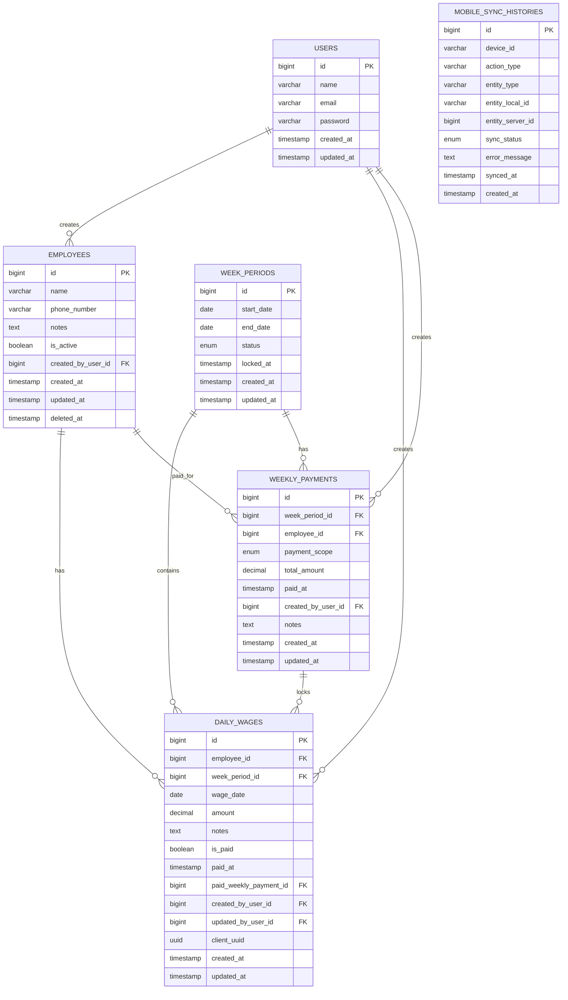

# ERD — Aplikasi Pencatatan Gaji Karyawan

## 1. Tujuan ERD

ERD ini memodelkan struktur data inti untuk aplikasi pencatatan gaji harian karyawan dengan pembayaran mingguan, locking setelah pembayaran, dan dukungan offline-first pada aplikasi mobile.

Fokus model data ini adalah:

* sederhana,
* mudah diimplementasikan,
* cukup fleksibel untuk edit selama minggu berjalan,
* tetap aman setelah pembayaran dilakukan.

---

## 2. Entitas Inti

Entitas inti yang dipakai:

1. **users** → owner aplikasi
2. **employees** → data karyawan
3. **week_periods** → representasi minggu kerja/pembayaran
4. **daily_wages** → catatan gaji harian per karyawan
5. **weekly_payments** → event pembayaran mingguan
6. **mobile_sync_histories** *(opsional)* → histori sinkronisasi mobile

---

## 3. ERD Konseptual

---

## 4. Penjelasan Tiap Entitas

## 4.1. `users`

Merepresentasikan pemilik aplikasi (owner) yang dapat login dan melakukan seluruh operasi.

### Kolom

* `id` — primary key
* `name` — nama user
* `email` — email login
* `password` — password hash
* `created_at`, `updated_at`

### Catatan

Untuk MVP hanya ada 1 role, jadi belum perlu tabel roles.

---

## 4.2. `employees`

Menyimpan data karyawan.

### Kolom

* `id`
* `name`
* `phone_number` nullable
* `notes` nullable
* `is_active` boolean
* `created_by_user_id` → FK ke `users.id`
* `created_at`, `updated_at`
* `deleted_at` nullable untuk soft delete

### Aturan

* Karyawan nonaktif tidak muncul di input gaji baru.
* Riwayat karyawan lama tetap tersimpan.

---

## 4.3. `week_periods`

Merepresentasikan satu periode minggu pembayaran.

### Kolom

* `id`
* `start_date`
* `end_date`
* `status` → `open`, `partial_paid`, `fully_paid`
* `locked_at` nullable
* `created_at`, `updated_at`

### Kenapa perlu tabel ini

Tanpa tabel minggu, logic pembayaran dan locking akan tercecer di banyak tempat. Dengan tabel ini, minggu menjadi entitas bisnis yang eksplisit.

---

## 4.4. `daily_wages`

Tabel inti pencatatan gaji harian per karyawan.

### Kolom

* `id`
* `employee_id` → FK ke `employees.id`
* `week_period_id` → FK ke `week_periods.id`
* `wage_date`
* `amount`
* `notes` nullable
* `is_paid` boolean
* `paid_at` nullable
* `paid_weekly_payment_id` nullable → FK ke `weekly_payments.id`
* `created_by_user_id` → FK ke `users.id`
* `updated_by_user_id` nullable → FK ke `users.id`
* `client_uuid` nullable → untuk idempotency sync mobile
* `created_at`, `updated_at`

### Aturan Penting

* **Unique**: `employee_id + wage_date`
* Satu karyawan hanya boleh punya satu catatan gaji per tanggal.
* Tidak boleh diedit jika sudah dibayar.

---

## 4.5. `weekly_payments`

Mencatat event pembayaran mingguan.

### Kolom

* `id`
* `week_period_id` → FK ke `week_periods.id`
* `employee_id` nullable → FK ke `employees.id`
* `payment_scope` → `employee` atau `all`
* `total_amount`
* `paid_at`
* `created_by_user_id` → FK ke `users.id`
* `notes` nullable
* `created_at`, `updated_at`

### Makna `employee_id`

* Jika `payment_scope = employee`, maka `employee_id` wajib terisi.
* Jika `payment_scope = all`, maka `employee_id` bisa `NULL`.

### Kenapa perlu tabel ini

Kalau hanya pakai `is_paid` di record harian, histori pembayaran jadi kabur. Tabel ini menyimpan jejak event pembayaran secara eksplisit.

---

## 4.6. `mobile_sync_histories` *(opsional)*

Mencatat histori sinkronisasi untuk kebutuhan audit/debug offline-first.

### Kolom

* `id`
* `device_id`
* `action_type`
* `entity_type`
* `entity_local_id` nullable
* `entity_server_id` nullable
* `sync_status` → `success`, `failed`
* `error_message` nullable
* `synced_at` nullable
* `created_at`

### Catatan

Untuk MVP awal, tabel ini opsional. Tapi kalau offline-first mau lebih kuat, tabel ini berguna.

---

## 5. Relasi Antar Tabel

## 5.1. `users` → `employees`

Satu user dapat membuat banyak employee.

**Relasi:**

* `users.id` → `employees.created_by_user_id`
* cardinality: **1 to many**

---

## 5.2. `users` → `daily_wages`

Satu user dapat membuat/memperbarui banyak catatan gaji harian.

**Relasi:**

* `users.id` → `daily_wages.created_by_user_id`
* `users.id` → `daily_wages.updated_by_user_id`
* cardinality: **1 to many**

---

## 5.3. `employees` → `daily_wages`

Satu employee memiliki banyak catatan gaji harian.

**Relasi:**

* `employees.id` → `daily_wages.employee_id`
* cardinality: **1 to many**

---

## 5.4. `week_periods` → `daily_wages`

Satu minggu memiliki banyak catatan gaji harian.

**Relasi:**

* `week_periods.id` → `daily_wages.week_period_id`
* cardinality: **1 to many**

---

## 5.5. `week_periods` → `weekly_payments`

Satu minggu dapat memiliki banyak event pembayaran.

Contoh:

* bayar Asep dulu,
* bayar Budi kemudian,
* atau bayar semua sekaligus.

**Relasi:**

* `week_periods.id` → `weekly_payments.week_period_id`
* cardinality: **1 to many**

---

## 5.6. `employees` → `weekly_payments`

Satu employee dapat memiliki banyak histori pembayaran mingguan lintas minggu.

**Relasi:**

* `employees.id` → `weekly_payments.employee_id`
* cardinality: **1 to many**

Catatan: nullable karena pembayaran bisa berscope `all`.

---

## 5.7. `weekly_payments` → `daily_wages`

Satu payment event dapat mengunci banyak daily wage records.

**Relasi:**

* `weekly_payments.id` → `daily_wages.paid_weekly_payment_id`
* cardinality: **1 to many**

---

## 6. Aturan Integritas Data

## 6.1. Unique Constraint

Pada `daily_wages`:

* `UNIQUE(employee_id, wage_date)`

Tujuan:

* mencegah duplikasi catatan gaji harian pada tanggal yang sama.

---

## 6.2. Check Constraint / Business Validation

### `week_periods.status`

Hanya boleh bernilai:

* `open`
* `partial_paid`
* `fully_paid`

### `weekly_payments.payment_scope`

Hanya boleh bernilai:

* `employee`
* `all`

### `weekly_payments`

* jika `payment_scope = employee`, maka `employee_id` wajib terisi
* jika `payment_scope = all`, maka `employee_id` harus `NULL` atau diabaikan

---

## 6.3. Locking Rule

Record pada `daily_wages` tidak boleh diubah jika:

* `is_paid = true`, atau
* `paid_weekly_payment_id` sudah terisi, atau
* `week_period` terkait berstatus `fully_paid`

Ini wajib dipaksa di backend, bukan hanya di UI.

---

## 7. Versi Tabel yang Disarankan untuk Implementasi Laravel

## 7.1. `users`

* id
* name
* email
* password
* timestamps

## 7.2. `employees`

* id
* name
* phone_number nullable
* notes nullable
* is_active default true
* created_by_user_id foreignId
* softDeletes
* timestamps

## 7.3. `week_periods`

* id
* start_date
* end_date
* status default `open`
* locked_at nullable
* timestamps

## 7.4. `daily_wages`

* id
* employee_id foreignId
* week_period_id foreignId
* wage_date
* amount decimal(12,2)
* notes nullable
* is_paid default false
* paid_at nullable
* paid_weekly_payment_id nullable foreignId
* created_by_user_id foreignId
* updated_by_user_id nullable foreignId
* client_uuid nullable unique
* timestamps
* unique(employee_id, wage_date)

## 7.5. `weekly_payments`

* id
* week_period_id foreignId
* employee_id nullable foreignId
* payment_scope string/enum
* total_amount decimal(12,2)
* paid_at
* created_by_user_id foreignId
* notes nullable
* timestamps

## 7.6. `mobile_sync_histories`

* id
* device_id
* action_type
* entity_type
* entity_local_id nullable
* entity_server_id nullable
* sync_status
* error_message nullable
* synced_at nullable
* timestamp
